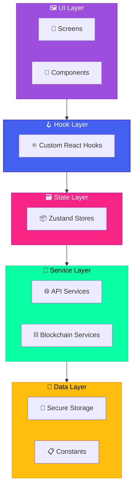
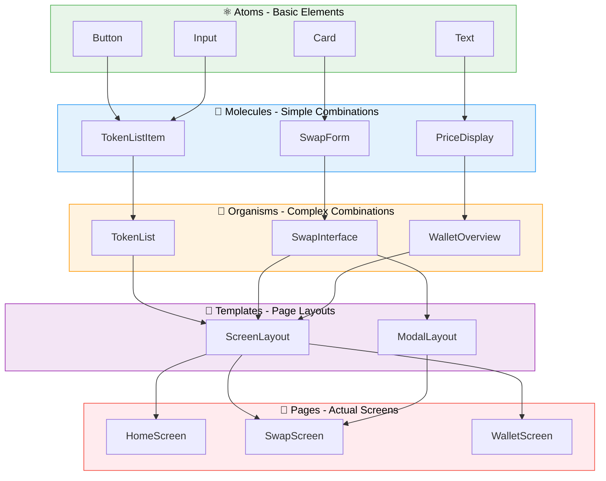
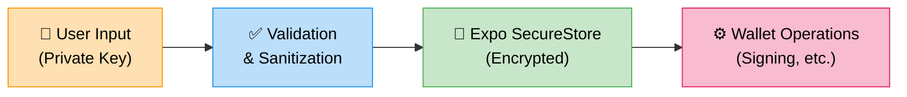
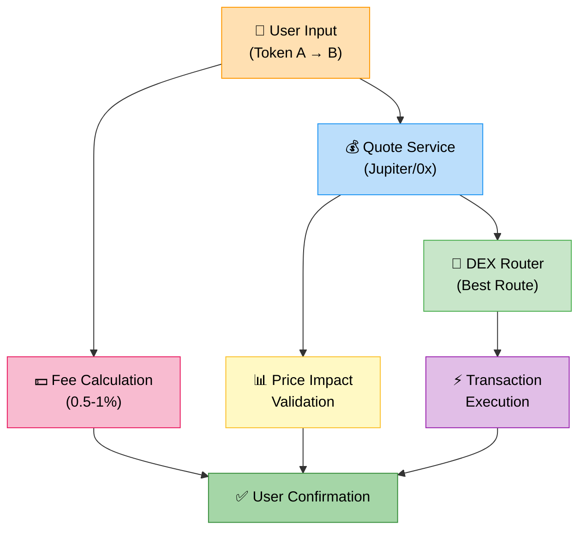
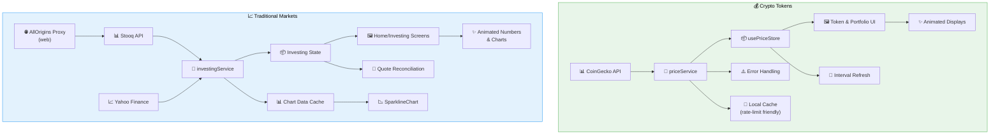
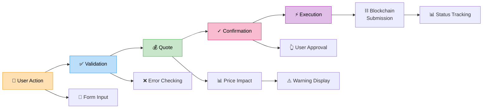

# RuneKey Architecture

This document provides a detailed overview of the RuneKey application architecture, explaining the design decisions, patterns, and structure used throughout the codebase.

## 🏗️ High-Level Architecture

RuneKey follows a layered architecture pattern with clear separation of concerns:



## 📂 Folder Structure

```
RuneKey/
├── src/
│   ├── components/          # Reusable UI components
│   │   ├── common/         # Generic components (Button, Input, Card)
│   │   ├── wallet/         # Wallet-specific components
│   │   ├── swap/           # Swap interface components
│   │   ├── token/          # Token display components
│   │   └── qr/             # QR code functionality
│   │
│   ├── screens/            # Main application screens
│   │   ├── HomeScreen.tsx              # Crypto portfolio overview
│   │   ├── SwapScreen.tsx              # Token swapping interface
│   │   ├── SearchScreen.tsx            # Discovery surface
│   │   ├── InvestingScreen.tsx         # Traditional markets dashboard
│   │   ├── InvestmentDetailsScreen.tsx # Live market detail view
│   │   └── SettingsScreen.tsx          # App settings
│   │
│   ├── hooks/              # Custom React hooks
│   │   ├── wallet/         # Wallet management hooks
│   │   ├── token/          # Token and price hooks
│   │   └── swap/           # Swap functionality hooks
│   │
│   ├── services/           # External service integrations
│   │   ├── api/            # API service classes
│   │   │   ├── priceService.ts        # CoinGecko integration
│   │   │   ├── investingService.ts    # Stooq & Yahoo Finance integration
│   │   │   └── swapService.ts         # Swap quotes & execution
│   │   └── blockchain/     # Blockchain interaction
│   │       ├── walletService.ts  # Wallet operations
│   │       ├── solanaService.ts  # Solana-specific
│   │       └── evmService.ts     # EVM-specific
│   │
│   ├── stores/             # Zustand state stores
│   │   ├── wallet/         # Wallet state management
│   │   └── app/            # Application-wide state
│   │
│   ├── types/              # TypeScript type definitions
│   ├── constants/          # Configuration and constants
│   └── utils/              # Utility functions
│
├── assets/                 # Static assets
├── App.tsx                 # Main application component
└── Configuration files...
```

## 🔧 Core Technologies

### Frontend Framework
- **React Native**: Cross-platform mobile development
- **Expo**: Development platform and toolchain
- **TypeScript**: Type safety and better developer experience

### State Management
- **Zustand**: Lightweight state management
- **React Query**: Server state management and caching

### Styling
- **TailwindCSS**: Utility-first CSS framework
- **NativeWind**: TailwindCSS for React Native

### Navigation
- **React Navigation**: Navigation library
- **Bottom Tab Navigator**: Main app navigation
- **Stack Navigator**: Screen transitions

### Blockchain Integration
- **Wagmi**: React hooks for Ethereum
- **Viem**: TypeScript interface for Ethereum
- **Solana Web3.js**: Solana blockchain interaction
- **Jupiter API**: Solana DEX aggregation
- **0x Protocol**: EVM DEX aggregation

### Market Data Providers
- **CoinGecko**: Primary source for cryptocurrency pricing and market metrics
- **Stooq**: Live equity, ETF, forex, and commodity quotes for the investing module
- **Yahoo Finance**: Historical candles powering investing charts
- **AllOrigins Proxy**: Browser-safe CORS passthrough for Stooq/Yahoo requests in web builds
- **USDT Reserve Accounting**: Active capital for traditional markets is calculated from the wallet’s USDT holdings

### Security
- **Expo SecureStore**: Encrypted local storage
- **Input validation**: Comprehensive validation utilities

## 🏛️ Architectural Patterns

### Component Architecture

#### Atomic Design Principles



#### Component Structure
```typescript
interface ComponentProps {
  // Required props
  title: string;
  // Optional props with defaults
  variant?: 'primary' | 'secondary';
  // Event handlers
  onPress?: () => void;
  // Style customization
  className?: string;
}

export const Component: React.FC<ComponentProps> = ({
  title,
  variant = 'primary',
  onPress,
  className = '',
}) => {
  // Local state
  const [isLoading, setIsLoading] = useState(false);
  
  // Custom hooks
  const { data, error } = useCustomHook();
  
  // Event handlers
  const handlePress = useCallback(() => {
    // Handle logic
    onPress?.();
  }, [onPress]);
  
  // Render
  return (
    <StyledView className={`base-classes ${className}`}>
      {/* Component content */}
    </StyledView>
  );
};
```

### State Management Architecture

#### Zustand Store Pattern
```typescript
interface StoreState {
  // State properties
  data: DataType[];
  isLoading: boolean;
  error: string | null;
}

interface StoreActions {
  // Action methods
  fetchData: () => Promise<void>;
  updateData: (data: DataType) => void;
  reset: () => void;
}

export const useStore = create<StoreState & StoreActions>()(
  persist(
    (set, get) => ({
      // Initial state
      data: [],
      isLoading: false,
      error: null,
      
      // Actions
      fetchData: async () => {
        set({ isLoading: true, error: null });
        try {
          const data = await apiService.fetchData();
          set({ data, isLoading: false });
        } catch (error) {
          set({ error: error.message, isLoading: false });
        }
      },
      
      updateData: (newData) => {
        set((state) => ({
          data: [...state.data, newData],
        }));
      },
      
      reset: () => {
        set({ data: [], isLoading: false, error: null });
      },
    }),
    {
      name: 'store-name',
      storage: createJSONStorage(() => secureStorage),
    }
  )
);
```

### Service Layer Architecture

#### Service Class Pattern
```typescript
class ApiService {
  private baseURL: string;
  
  constructor() {
    this.baseURL = API_ENDPOINTS.BASE;
  }
  
  async fetchData<T>(endpoint: string): Promise<ApiResponse<T>> {
    try {
      const response = await axios.get(`${this.baseURL}${endpoint}`);
      return {
        data: response.data,
        success: true,
      };
    } catch (error) {
      return {
        data: null,
        success: false,
        error: error.message,
      };
    }
  }
}

export const apiService = new ApiService();
```

### Custom Hook Architecture

#### Hook Composition Pattern
```typescript
export const useFeature = () => {
  // Store access
  const { data, actions } = useStore();
  
  // Local state
  const [localState, setLocalState] = useState();
  
  // Other hooks
  const { relatedData } = useRelatedHook();
  
  // Computed values
  const computedValue = useMemo(() => {
    return data.map(/* transformation */);
  }, [data]);
  
  // Event handlers
  const handleAction = useCallback(async (params) => {
    try {
      await actions.performAction(params);
    } catch (error) {
      // Handle error
    }
  }, [actions]);
  
  // Effects
  useEffect(() => {
    // Side effects
  }, [/* dependencies */]);
  
  // Return hook interface
  return {
    // State
    data,
    localState,
    isLoading: actions.isLoading,
    
    // Computed
    computedValue,
    
    // Actions
    handleAction,
    
    // Utilities
    refresh: actions.fetchData,
  };
};
```

## 🔐 Security Architecture

### Private Key Management



### Data Flow Security
1. **Input Validation**: All user inputs validated
2. **Secure Storage**: Private keys encrypted at rest
3. **No Network Transmission**: Private keys never sent to servers
4. **Error Boundaries**: Graceful error handling
5. **Type Safety**: TypeScript prevents runtime errors

## 🌐 Multi-Chain Architecture

### Network Abstraction
```typescript
interface NetworkHandler {
  generateWallet(): Promise<Wallet>;
  importWallet(key: string): Promise<Wallet>;
  getBalance(address: string): Promise<string>;
  sendTransaction(params: TxParams): Promise<string>;
}

class SolanaHandler implements NetworkHandler {
  // Solana-specific implementation
}

class EVMHandler implements NetworkHandler {
  // EVM-specific implementation
}

class NetworkManager {
  private handlers: Map<SupportedNetwork, NetworkHandler>;
  
  getHandler(network: SupportedNetwork): NetworkHandler {
    return this.handlers.get(network);
  }
}
```

### Swap Integration



## 📊 Data Flow Architecture

### Market Data Flow



### Transaction Flow



### Investing Module Overview
- **Data Fetching**: `investingService` orchestrates Stooq spot quotes and Yahoo Finance chart pulls. On web, requests are routed through the AllOrigins proxy to bypass CORS restrictions.
- **State Management**: Quotes hydrate lightweight in-memory state that powers both the Home investing tile and the full Investing screens.
- **Fallback Strategy**: Mock data keeps UI responsive if upstream providers rate limit or return incomplete payloads; previous successful quotes are retained until fresh data arrives.
- **Animations**: Price deltas flow into animated number and chart components for smooth transitions during refresh cycles.
- **Funding Model**: The investing totals treat the wallet’s USDT balance as deployable capital for synthetic allocations into equities/ETFs/forex/commodities.

## 🎨 Theming Architecture

### Theme System
```typescript
type Theme = 'light' | 'dark' | 'system';

const ThemeProvider = {
  light: {
    background: '#FFFFFF',
    text: '#111827',
    primary: '#3B82F6',
    // ... more colors
  },
  dark: {
    background: '#111827',
    text: '#F9FAFB',
    primary: '#3B82F6',
    // ... more colors
  }
};

// Automatic theme switching
const useTheme = () => {
  const { theme } = useAppStore();
  const systemTheme = useColorScheme();
  
  return theme === 'system' ? systemTheme : theme;
};
```

## 🚀 Performance Architecture

### Optimization Strategies
1. **Code Splitting**: Feature-based code splitting
2. **Lazy Loading**: Components loaded on demand
3. **Memoization**: React.memo and useMemo for expensive operations
4. **Virtualization**: Large lists with FlatList
5. **Image Optimization**: Cached token images
6. **API Caching**: React Query for server state caching

### Bundle Optimization
```
Bundle Structure:
├── Core App (~2MB)
│   ├── Navigation
│   ├── Basic Components
│   └── Essential Hooks
├── Blockchain (~1.5MB)
│   ├── Solana SDK
│   ├── EVM Libraries
│   └── Crypto Utilities
└── Features (~1MB)
    ├── Swap Interface
    ├── Price Services
    └── Advanced Components
```

## 🧪 Testing Architecture

### Testing Strategy
```
Testing Pyramid:
           ┌─────────────────┐
           │   E2E Tests     │  ← Critical user flows
           │   (Few)         │
           ├─────────────────┤
           │ Integration     │  ← Component interactions
           │ Tests (Some)    │
           ├─────────────────┤
           │  Unit Tests     │  ← Individual functions
           │   (Many)        │
           └─────────────────┘
```

### Test Categories
1. **Unit Tests**: Utilities, hooks, services
2. **Component Tests**: UI component behavior
3. **Integration Tests**: Feature workflows
4. **E2E Tests**: Complete user journeys

## 🔄 Future Architecture Considerations

### Scalability Enhancements
1. **Micro-frontends**: Feature-based app splitting
2. **State Normalization**: Complex data relationships
3. **Background Services**: Price updates, notifications
4. **Offline Support**: Local caching and sync
5. **Plugin Architecture**: Third-party integrations

### Technical Debt Management
1. **Regular Refactoring**: Quarterly architecture reviews
2. **Dependency Updates**: Monthly security updates
3. **Performance Monitoring**: Bundle size tracking
4. **Code Quality**: Automated quality gates

## 📈 Monitoring & Analytics

### Error Tracking
- Crash reporting with Sentry
- Performance monitoring
- User analytics (privacy-focused)
- Feature usage tracking

### Development Tools
- ESLint for code quality
- TypeScript for type safety
- React Developer Tools
- Flipper for debugging

---

This architecture provides a solid foundation for a production-ready cryptocurrency wallet while maintaining flexibility for future enhancements and scaling.