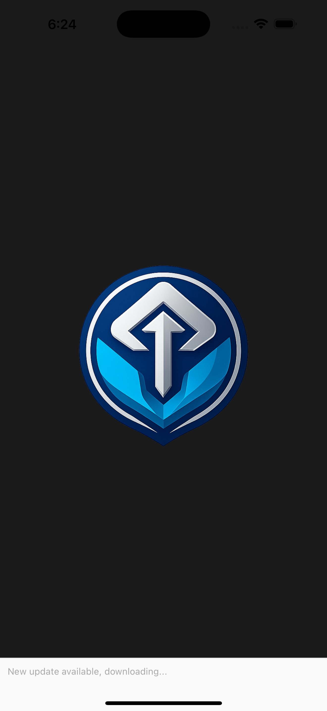
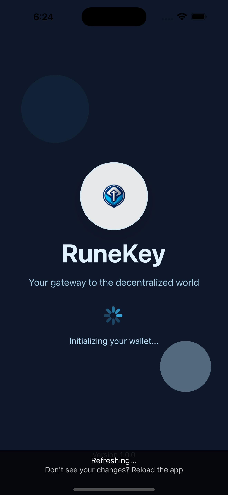
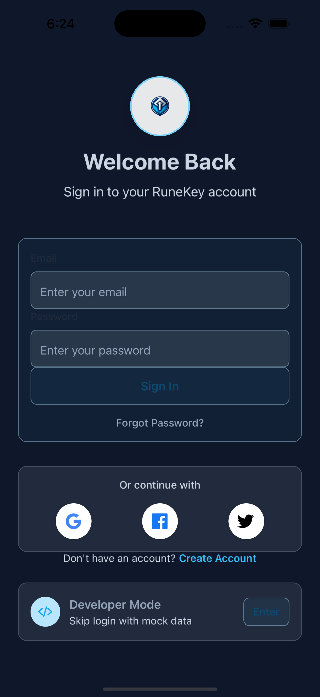
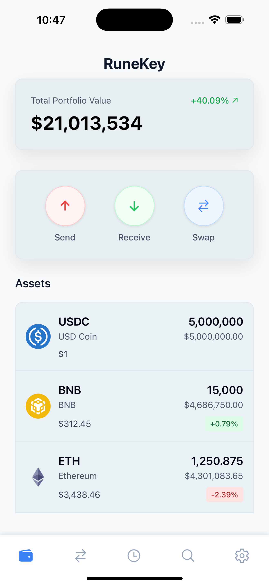
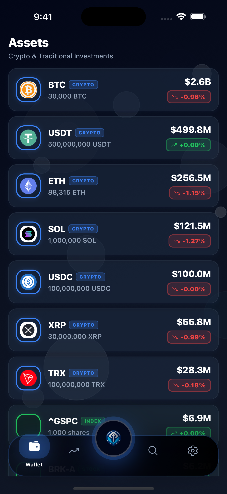
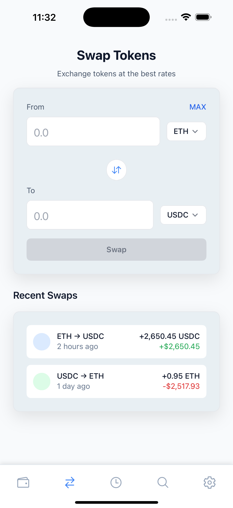
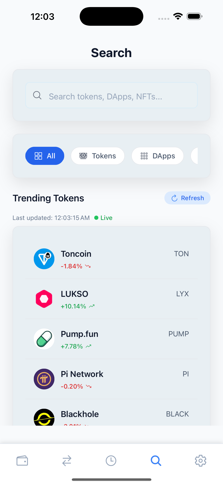
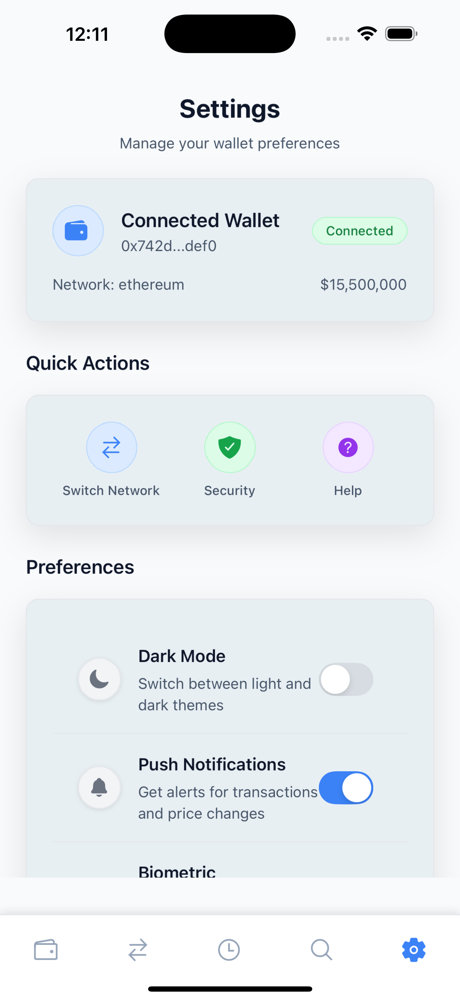

# RuneKey - Cross-Platform Crypto Wallet

<div align="center">
  <h3>🔑 Your gateway to the decentralized world</h3>
  <p>A modern, secure, and user-friendly multi-chain cryptocurrency wallet built with React Native</p>
</div>

## ✨ Features

### Core Functionality
- 🔐 **Secure Wallet Management** – Generate, import, and manage crypto wallets
- 🌐 **Multi-Chain Support** – Ethereum, Polygon, BSC, Avalanche, Arbitrum, Optimism, and Solana
- 💱 **Token Swaps** – Integrated DEX aggregators (Jupiter for Solana, 0x for EVM chains)
- 💰 **Real-time Prices** – Live crypto pricing via CoinGecko with in-app caching
- 📱 **QR Code Scanning** – Easy wallet address scanning
- 📊 **Portfolio Tracking** – Complete portfolio overview with USD values
- 📈 **Investing Dashboard** – Allocate USDT reserves into synthetic equity, ETF, forex, and commodity positions with live quotes (Stooq) and market charts (Yahoo Finance)

### Advanced Features
- 🔄 **Monetization Ready** – Built-in swap fee integration (0.5-1% spread)
- 🌙 **Dark Mode Support** – Automatic theme switching
- 🔒 **Secure Storage** – Private keys encrypted with Expo SecureStore
- 🏗️ **Scalable Architecture** – Modular design for easy feature additions
- 🎛️ **Feature Flags** – Toggle features on/off for different user segments
- 🧪 **Developer Wallet Mode** – One-tap connection to a pre-funded dev wallet for demo data

### Coming Soon
- 🏦 **Staking Support** - Stake tokens to earn rewards
- 🖼️ **NFT Management** - View and manage NFT collections
- 🔗 **WalletConnect v2** - Connect to dApps seamlessly
- 💹 **DeFi Integration** - Lending, borrowing, and yield farming

## 🛠️ Technology Stack

- **Frontend**: React Native with Expo
- **Language**: TypeScript
- **Styling**: TailwindCSS with NativeWind
- **State Management**: Zustand
- **Blockchain**: Wagmi (EVM), Solana Web3.js
- **Navigation**: React Navigation
- **Security**: Expo SecureStore
- **API**: Axios with React Query
- **Data Providers**: CoinGecko (crypto pricing), Stooq (equity/FX/commodity quotes), Yahoo Finance (historical charts), AllOrigins (CORS passthrough for web builds)

## 📱 Supported Platforms

- iOS (iPhone & iPad)
- Android
- Web (Progressive Web App)

## 📸 Screenshots

<div align="center">
  <h4>🎨 App Screenshots</h4>
  <p>Explore the beautiful and intuitive interface of RuneKey</p>
  
  <table>
    <tr>
      <td align="center">
        <strong>Splash Screen</strong><br/>
        
      </td>
      <td align="center">
        <strong>Wallet Initialization</strong><br/>
        
      </td>
      <td align="center">
        <strong>Login Screen</strong><br/>
        
      </td>
    </tr>
    <tr>
      <td align="center">
        <strong>Home Screen</strong><br/>
        
      </td>
      <td align="center">
        <strong>Wallet Management</strong><br/>
        
      </td>
      <td align="center">
        <strong>Token Swap</strong><br/>
        
      </td>
    </tr>
    <tr>
      <td align="center">
        <strong>Search & Discovery</strong><br/>
        
      </td>
      <td align="center">
        <strong>Recent Activity</strong><br/>
        
      </td>
      <td align="center">
        <strong>Settings</strong><br/>
        
      </td>
    </tr>
  </table>
  
  <p><a href="docs/screenshots/screenshots.md">📖 View All Screenshots</a></p>
</div>

## 🚀 Quick Start

### Prerequisites
- Node.js (v16 or higher)
- npm or yarn
- Expo CLI: `npm install -g @expo/cli`
- For iOS: Xcode (macOS only)
- For Android: Android Studio

### Installation

1. **Clone the repository**
   ```bash
   git clone https://github.com/your-username/runekey.git
   cd runekey
   ```

2. **Install dependencies**
   ```bash
   npm install
   # or
   yarn install
   ```

3. **Start the development server**
   ```bash
   npm start
   # or
   yarn start
   ```

4. **Run on device/simulator**
   - iOS: Press `i` in the terminal or scan QR code with Camera app
   - Android: Press `a` in the terminal or scan QR code with Expo Go app
   - Web: Press `w` in the terminal

## 📁 Project Structure

```
RuneKey/
├── src/
│   ├── components/          # Reusable UI components
│   │   ├── common/         # Generic components (Button, Input, Card)
│   │   ├── wallet/         # Wallet-specific components
│   │   ├── swap/           # Swap-related components
│   │   ├── token/          # Token display components
│   │   └── qr/             # QR code components
│   ├── screens/            # Main app screens
│   │   ├── HomeScreen.tsx              # Crypto portfolio overview
│   │   ├── SwapScreen.tsx              # Token swapping interface
│   │   ├── SearchScreen.tsx            # Discovery experience
│   │   ├── InvestingScreen.tsx         # Traditional markets dashboard
│   │   ├── InvestmentDetailsScreen.tsx # Live market detail view
│   │   └── SettingsScreen.tsx          # App preferences
│   ├── hooks/              # Custom React hooks
│   │   ├── wallet/         # Wallet management hooks
│   │   ├── token/          # Token and price hooks
│   │   └── swap/           # Swap functionality hooks
│   ├── services/           # External service integrations
│   │   ├── api/            # API service classes
│   │   │   ├── priceService.ts        # CoinGecko integration
│   │   │   ├── investingService.ts    # Stooq & Yahoo Finance integration
│   │   │   └── swapService.ts         # DEX aggregation (Jupiter / 0x)
│   │   └── blockchain/     # Blockchain interaction services
│   ├── stores/             # Zustand state stores
│   │   ├── wallet/         # Wallet state management
│   │   └── app/            # App-wide state management
│   ├── types/              # TypeScript type definitions
│   ├── constants/          # App constants and configuration
│   └── utils/              # Utility functions
├── assets/                 # Static assets (images, fonts)
├── App.tsx                 # Main app component
└── package.json           # Dependencies and scripts
```

## 📈 Live Market Data Overview

- **Crypto Tokens** – CoinGecko API powers token pricing with a 30-second refresh cadence and local caching to respect rate limits.
- **Traditional Markets** – Stooq provides spot quotes for equities, ETFs, forex, and commodities (routed through AllOrigins on web, direct fetch on native). Yahoo Finance supplies historical candles for charts.
- **Developer Wallet Auto-Refresh** – The preconfigured developer wallet refreshes on focus to ensure live values populate demo environments.
- **Fallbacks** – Structured mock data keeps screens responsive whenever upstream APIs are unavailable or rate-limited.
- **Capital Source** – Active capital is derived from the wallet’s USDT balance; investing allocations simulate deploying those stablecoin reserves into traditional assets.
- **Deep Dive** – See [`docs/Investing_Data_Flow.md`](docs/Investing_Data_Flow.md) for architecture and provider details.

## 🔧 Configuration

### Environment Variables
Create a `.env` file in the root directory:

```env
# API Keys (optional - app works without them)
EXPO_PUBLIC_COINGECKO_API_KEY=your_coingecko_api_key
EXPO_PUBLIC_0X_API_KEY=your_0x_api_key

# Network RPC URLs (optional - defaults provided)
EXPO_PUBLIC_ETHEREUM_RPC_URL=https://ethereum.rpc.thirdweb.com
EXPO_PUBLIC_POLYGON_RPC_URL=https://polygon.rpc.thirdweb.com
EXPO_PUBLIC_SOLANA_RPC_URL=https://api.mainnet-beta.solana.com
```

> **Heads-up:** Web builds default to the public [AllOrigins](https://allorigins.win/) proxy for CORS-safe requests to Stooq and Yahoo Finance. For production deployments you should supply your own proxy or relay service to guarantee uptime and rate-limit control.

### Customization

#### Adding New Networks
1. Update `src/constants/networks.ts`
2. Add network configuration to `NETWORK_CONFIGS`
3. Update types in `src/types/index.ts`

#### Modifying Swap Fees
Edit `src/constants/index.ts`:
```typescript
export const APP_CONFIG = {
  SWAP_FEE_PERCENTAGE: 0.5, // 0.5% fee
  MIN_SWAP_FEE_USD: 1,
  MAX_SWAP_FEE_USD: 100,
};
```

## 🔒 Security

- Private keys are encrypted and stored locally using Expo SecureStore
- No private keys are ever transmitted to external servers
- All API communications use HTTPS
- Input validation on all user inputs
- Secure random number generation for wallet creation

## 🧪 Testing

```bash
# Run type checking
npm run type-check

# Run linting
npm run lint

# Run tests (when implemented)
npm test
```

## 📦 Building for Production

### iOS
```bash
# Build for iOS
expo build:ios

# Or using EAS Build (recommended)
eas build --platform ios
```

### Android
```bash
# Build for Android
expo build:android

# Or using EAS Build (recommended)
eas build --platform android
```

### Web
```bash
# Build for web
expo build:web
```

## 🤝 Contributing

1. Fork the repository
2. Create a feature branch: `git checkout -b feature/amazing-feature`
3. Commit your changes: `git commit -m 'Add amazing feature'`
4. Push to the branch: `git push origin feature/amazing-feature`
5. Open a Pull Request

## 📄 License

This project is licensed under the MIT License - see the [LICENSE](LICENSE) file for details.

## 🆘 Support

- Create an issue for bug reports or feature requests
- Join our Discord community: [Coming Soon]
- Email: support@runekey.com

## 🗺️ Roadmap

### Phase 1 (Current)
- ✅ Multi-chain wallet support
- ✅ Token swaps with DEX aggregation
- ✅ Real-time price tracking
- ✅ QR code scanning
- ✅ Dark mode support

### Phase 2
- 🔄 WalletConnect v2 integration
- 🔄 Enhanced security features
- 🔄 Transaction history improvements
- 🔄 Fiat on/off ramps

### Phase 3
- ⏳ Staking and DeFi protocols
- ⏳ NFT support and marketplace
- ⏳ Advanced portfolio analytics
- ⏳ Cross-chain bridging

### Phase 4
- ⏳ Hardware wallet support
- ⏳ Multi-signature wallets
- ⏳ DAO governance integration
- ⏳ Advanced trading features

## 🙏 Acknowledgments

- [Expo](https://expo.dev/) for the amazing React Native framework
- [Wagmi](https://wagmi.sh/) for Ethereum integration
- [Solana Web3.js](https://solana-labs.github.io/solana-web3.js/) for Solana support
- [Jupiter](https://jup.ag/) for Solana DEX aggregation
- [0x](https://0x.org/) for EVM DEX aggregation
- [CoinGecko](https://coingecko.com/) for price data

---

<div align="center">
  <p>Made with ❤️ by the RuneKey team</p>
  <p>🔑 Unlock the future of finance</p>
</div>