# 📈 Investing Module Data Flow

This guide documents how RuneKey powers the traditional markets experience (equities, ETFs, forex, and commodities) that appears in both the Home screen investing tile and the dedicated Investing screens.

---

## 🔌 Data Providers

| Source | Purpose | Notes |
| --- | --- | --- |
| **Stooq** | Live spot quotes for equities, ETFs, forex pairs, and commodities | Queried per-symbol to avoid rate limits; data includes open/close values for intraday change calculations |
| **Yahoo Finance** | Historical candles for performance charts | Provides timeframe-specific price history (1D–1Y) |
| **AllOrigins** | Browser-safe CORS proxy | Only used on web builds; native apps hit Stooq/Yahoo directly |

---

## 🧱 Key Components

- `investingService.ts` – Fetches Stooq quotes and Yahoo Finance charts, handling CORS-specific URL composition for web builds.
- `InvestingScreen.tsx` – Displays the holdings overview, pulling quotes from `investingService`.
- `InvestmentDetailsScreen.tsx` – Shows instrument-level charts, price deltas, and P&L calculations.
- `HomeScreen.tsx` – Surface-level investing summary tile that reuses the same totals and quote logic.
- `USDT Active Capital` – The wallet’s USDT balance is treated as investable capital for these synthetic positions.

---

## 🔁 Quote Refresh Flow

```mermaid
flowchart TD
    A["📋 Symbols<br/>(from mockData/investing.json)"] --> B["🔧 investingService.fetchQuotes()"]
    
    B --> C1["🌐 Web Path"]
    B --> C2["📱 Native Path"]
    
    C1 --> D1["🌍 AllOrigins Proxy"]
    D1 --> E["📊 Stooq API"]
    C2 --> E
    
    E --> F["📈 Quote Normalization<br/>(price + change%)"]
    F --> G["💼 Investing Totals<br/>& Holdings State"]
    G --> H["🖼️ Home & Investing UIs<br/>+ Animated Numbers"]
    
    style A fill:#E8F5E9,stroke:#4CAF50,color:#000
    style B fill:#E3F2FD,stroke:#2196F3,color:#000
    style C1 fill:#FFF3E0,stroke:#FF9800,color:#000
    style C2 fill:#F3E5F5,stroke:#9C27B0,color:#000
    style E fill:#FFEBEE,stroke:#F44336,color:#000
    style F fill:#E0F2F1,stroke:#009688,color:#000
    style G fill:#FFF9C4,stroke:#FBC02D,color:#000
    style H fill:#FCE4EC,stroke:#E91E63,color:#000
```

- Quotes are requested in parallel to minimize latency.
- The service retains previous successful quotes so UI never flashes to zero if a single request fails.
- Missing symbols are logged to aid debugging.

---

## 📊 Chart Refresh Flow

```mermaid
flowchart TD
    A["👤 User selects timeframe<br/>(1D / 5D / 1MO / 3MO / 6MO / 1Y)"] --> B["🔧 investingService.fetchChart<br/>(symbol, config)"]
    
    B --> C1["🌐 Web Path"]
    B --> C2["📱 Native Path"]
    
    C1 --> D1["🌍 AllOrigins Proxy"]
    D1 --> E["📈 Yahoo Finance<br/>Chart API"]
    C2 --> E
    
    E --> F["📊 Timestamp & Close<br/>Extraction"]
    F --> G["📉 SparklineChart Rendering<br/>in InvestmentDetailsScreen"]
    
    style A fill:#E8F5E9,stroke:#4CAF50,color:#000
    style B fill:#E3F2FD,stroke:#2196F3,color:#000
    style C1 fill:#FFF3E0,stroke:#FF9800,color:#000
    style C2 fill:#F3E5F5,stroke:#9C27B0,color:#000
    style E fill:#FFEBEE,stroke:#F44336,color:#000
    style F fill:#E0F2F1,stroke:#009688,color:#000
    style G fill:#FCE4EC,stroke:#E91E63,color:#000
```

- Chart data is request-scoped (per symbol + timeframe) and not globally cached.
- The UI indicates loading and falls back to a friendly error message if the provider rate-limits or returns invalid data.

---

## 🛡️ Resilience & Fallbacks

- **Mock Portfolio** – `mockData/investing.json` defines quantities and entry prices so P&L can be derived even when live quotes are unavailable.
- **Graceful Degradation** – Previous totals persist unless a successful refresh replaces them; warnings are logged for missing symbols.
- **Dev Wallet Synergy** – When the developer wallet is auto-connected, coin data and investing data refresh in tandem so demo environments stay fresh.
- **Stablecoin Funding** – Active capital is denominated in USDT; the system assumes swaps from the crypto wallet fund the traditional allocations.

---

## 🚀 Production Notes

- The project currently uses the public AllOrigins instance. For production deployments, configure a self-hosted proxy or lightweight backend relay to guarantee uptime and predictable rate limits.
- Consider batching symbols server-side if the investing portfolio grows beyond a handful of instruments to keep request counts low.
- Monitor provider rate limits (Stooq and Yahoo Finance) and add exponential backoff if refresh intervals become more aggressive.

---

With this pipeline in place, RuneKey delivers live traditional market insights alongside on-chain portfolio data while remaining resilient to provider hiccups. Feel free to extend the module with additional providers, caching, or analytics as the investing surface evolves. 

